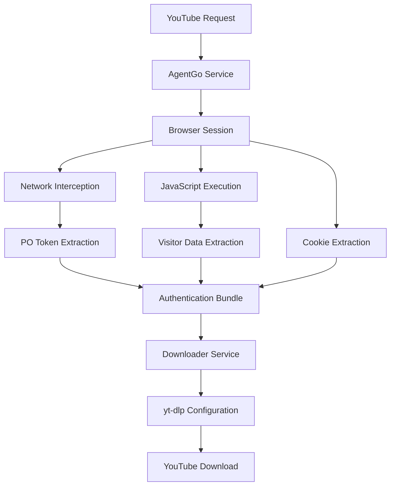

# Design Document

## Overview

This design enhances the existing YouTube download service to extract and utilize YouTube's advanced authentication tokens (PO Token and Visitor Data) through browser automation. The solution extends the current AgentGo service to perform network interception and JavaScript execution for token extraction, then configures yt-dlp with these tokens to bypass YouTube's SABR anti-bot protocol.

The enhancement maintains backward compatibility with the existing cookie-based authentication while adding robust token extraction capabilities. The design follows a layered approach where token extraction is performed in the browser automation layer, and token utilization is handled in the download service layer.

## Architecture

The enhanced architecture consists of three main components:

1. **Token Extraction Layer (AgentGo Service)**: Extends browser automation to capture network requests and execute JavaScript for token extraction
2. **Authentication Bundle**: Data structure containing cookies, PO token, and visitor data
3. **Download Configuration Layer (Downloader Service)**: Configures yt-dlp with extracted tokens using extractor_args



## Components and Interfaces

### TokenExtractor Class

A new component within the AgentGo service responsible for token extraction:

```python
class TokenExtractor:
    async def extract_po_token(self, page: Page) -> Optional[str]
    async def extract_visitor_data(self, page: Page) -> Optional[str]
    def validate_po_token(self, token: str) -> bool
    def validate_visitor_data(self, data: str) -> bool
```

### AuthenticationBundle Class

Data structure to encapsulate all authentication data:

```python
class AuthenticationBundle:
    cookies: List[Dict[str, Any]]
    po_token: Optional[str]
    visitor_data: Optional[str]
    region: str
    extraction_timestamp: datetime
```

### Enhanced AgentGoService Interface

Extended methods for token extraction:

```python
class AgentGoService:
    async def get_youtube_authentication_bundle(
        self, 
        region: Optional[str] = None,
        force_refresh: bool = False
    ) -> Optional[AuthenticationBundle]
```

### Enhanced YouTubeDownloader Interface

Modified to accept authentication bundles:

```python
class YouTubeDownloader:
    def configure_with_tokens(self, auth_bundle: AuthenticationBundle) -> Dict[str, Any]
    async def download_with_enhanced_auth(
        self, 
        url: str, 
        output_dir: str,
        auth_bundle: Optional[AuthenticationBundle] = None
    ) -> Tuple[str, Dict[str, Any]]
```

## Data Models

### AuthenticationBundle Model

```python
class AuthenticationBundle(BaseModel):
    """Complete authentication data for YouTube access."""
    cookies: List[Dict[str, Any]] = Field(description="Browser cookies")
    po_token: Optional[str] = Field(default=None, description="YouTube PO token")
    visitor_data: Optional[str] = Field(default=None, description="YouTube visitor data")
    region: str = Field(description="Geographic region of extraction")
    extraction_timestamp: datetime = Field(description="When tokens were extracted")
    cookie_file_path: Optional[str] = Field(default=None, description="Path to cookie file")
    
    def is_expired(self, max_age_seconds: int = 3600) -> bool:
        """Check if authentication bundle has expired."""
        pass
    
    def has_tokens(self) -> bool:
        """Check if bundle contains PO token or visitor data."""
        pass
```

### TokenExtractionResult Model

```python
class TokenExtractionResult(BaseModel):
    """Result of token extraction attempt."""
    success: bool
    po_token: Optional[str] = None
    visitor_data: Optional[str] = None
    error_message: Optional[str] = None
    extraction_method: str  # "network_intercept" or "javascript"
    extraction_duration: float  # seconds
```

## Correctness Properties

*A property is a characteristic or behavior that should hold true across all valid executions of a system-essentially, a formal statement about what the system should do. Properties serve as the bridge between human-readable specifications and machine-verifiable correctness guarantees.*

Based on the prework analysis, I'll consolidate related properties to eliminate redundancy:

**Property Reflection:**
- Properties 1.1 and 2.1 both test monitoring/execution during page navigation - can be combined
- Properties 1.3, 2.4, 4.1, 4.2 all test error handling with graceful continuation - can be consolidated
- Properties 3.1, 3.2, 3.3, 3.4 all test yt-dlp configuration - can be combined into comprehensive configuration property
- Properties 5.1, 5.2, 5.3, 5.4, 5.5 all test logging behavior - can be consolidated into secure logging property

Property 1: Network monitoring and JavaScript execution during navigation
*For any* YouTube page navigation, the system should monitor network requests for PO tokens and execute JavaScript for visitor data extraction
**Validates: Requirements 1.1, 2.1**

Property 2: Token extraction and parsing
*For any* network request containing "pot=" parameter, the system should capture, parse, and format the token as "web+{token}"
**Validates: Requirements 1.2, 1.4**

Property 3: Token selection from multiple candidates
*For any* set of multiple PO tokens with timestamps, the system should select the most recent valid token
**Validates: Requirements 1.5**

Property 4: Visitor data extraction methods
*For any* visitor data extraction attempt, the system should try both window.ytcfg.get('VISITOR_DATA') and window.ytcfg.data_.VISITOR_DATA methods and validate results as non-empty strings
**Validates: Requirements 2.2, 2.3**

Property 5: Authentication bundle inclusion
*For any* successfully extracted visitor data or PO token, the system should include it in the authentication bundle
**Validates: Requirements 2.5**

Property 6: yt-dlp configuration with tokens
*For any* authentication bundle with tokens, the system should configure yt-dlp with extractor_args containing player_client='web', PO token with 'web+' prefix, and visitor_data parameter
**Validates: Requirements 3.1, 3.2, 3.3, 3.4**

Property 7: Fallback to cookie-only authentication
*For any* authentication bundle without tokens, the system should configure yt-dlp with cookie-only authentication
**Validates: Requirements 3.5, 4.5**

Property 8: Graceful error handling
*For any* token extraction error (JavaScript, network, parsing, timeout), the system should catch exceptions, log errors, and continue with available authentication data
**Validates: Requirements 1.3, 2.4, 4.1, 4.2, 4.3, 4.4**

Property 9: Secure logging throughout extraction
*For any* token extraction operation, the system should log attempts, successes, and failures with timestamps while never exposing sensitive token values
**Validates: Requirements 5.1, 5.2, 5.3, 5.4, 5.5**

## Error Handling

The system implements comprehensive error handling at multiple levels:

### Token Extraction Errors
- **JavaScript Execution Failures**: Caught and logged, system continues with cookie-only authentication
- **Network Interception Failures**: Logged with specific error details, extraction continues with available methods
- **Token Parsing Errors**: Invalid tokens are discarded, system validates format before usage
- **Timeout Handling**: Maximum wait time enforced, graceful termination after timeout

### Authentication Fallback Strategy
1. **Primary**: Full authentication bundle (cookies + PO token + visitor data)
2. **Secondary**: Partial bundle (cookies + either PO token or visitor data)
3. **Fallback**: Cookie-only authentication (existing behavior)

### Logging Strategy
- All extraction attempts logged with timestamps
- Success/failure status logged without exposing sensitive data
- Error details logged for debugging
- Configuration changes logged securely

## Testing Strategy

The testing approach combines unit testing for specific components and property-based testing for universal behaviors.

### Unit Testing Approach
- Mock browser sessions for controlled token extraction testing
- Test specific error scenarios (network failures, JavaScript errors)
- Verify yt-dlp configuration with known token values
- Test authentication bundle creation and validation

### Property-Based Testing Approach
The system will use **Hypothesis** as the property-based testing library for Python. Each property-based test will run a minimum of 100 iterations to ensure comprehensive coverage of the input space.

Property-based tests will focus on:
- Token extraction behavior across various network request patterns
- Authentication bundle handling with different token combinations
- yt-dlp configuration consistency across all authentication scenarios
- Error handling robustness across different failure modes
- Logging security across all extraction operations

Each property-based test will be tagged with comments explicitly referencing the correctness property from this design document using the format: '**Feature: youtube-token-extraction, Property {number}: {property_text}**'

### Test Data Generation
- **Network Request Generators**: Create realistic YouTube network requests with various pot parameter patterns
- **Token Generators**: Generate valid and invalid PO tokens and visitor data
- **Error Scenario Generators**: Simulate various failure conditions (timeouts, JavaScript errors, network failures)
- **Authentication Bundle Generators**: Create bundles with different combinations of cookies, tokens, and visitor data