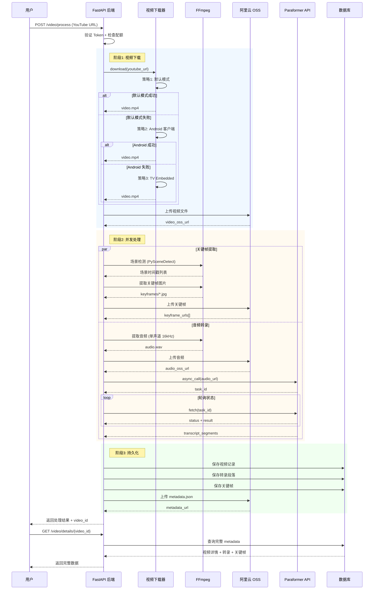
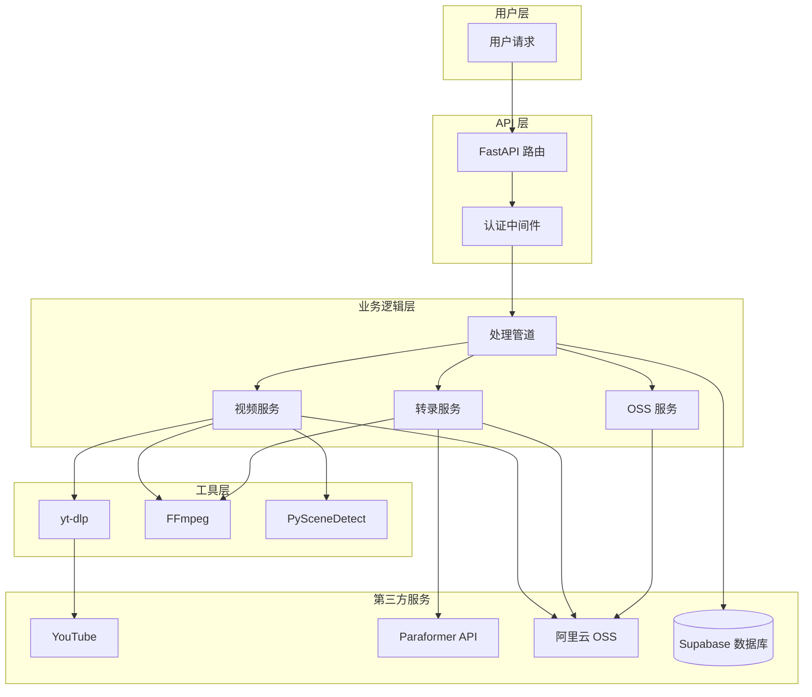

# 核心技术模块迁移与实施文档

## 📋 文档概述

**目标**: 从现有全栈 SaaS 平台提取核心功能模块，构建轻量级 MVP 产品（类似 clipto.com）  
**核心业务**: YouTube 视频下载 + AI 语音转文字 (Transcription)  
**文档版本**: v1.0  
**生成日期**: 2024-12-14

---

## 1️⃣ 技术栈清单 (Tech Stack & Dependencies)

### 1.1 核心依赖库

#### **视频下载引擎**
```python
yt-dlp>=2024.10.7  # YouTube 视频下载核心库（2024年最新版，支持最新反爬机制）
```

#### **音频/视频处理**
```python
ffmpeg-python>=0.2.0         # FFmpeg Python 绑定
scenedetect[opencv]>=0.6.2   # PySceneDetect 场景检测（关键帧提取）
```

#### **AI 语音转录**
```python
dashscope>=1.14.0            # 阿里云 DashScope SDK（Paraformer-v2 转录模型）
```

#### **云存储**
```python
oss2>=2.18.0                 # 阿里云 OSS Python SDK
```

#### **基础工具**
```python
requests>=2.31.0             # HTTP 请求库
numpy>=1.24.0                # 数值计算
asyncio>=3.4.3               # 异步任务支持
python-dotenv>=1.0.0         # 环境变量管理
```

### 1.2 系统级依赖

#### **必装软件**
- **FFmpeg** (>= 4.4)  
  - 用途：音频提取、视频格式转换、关键帧提取
  - 安装方式：
    ```bash
    # macOS
    brew install ffmpeg
    
    # Ubuntu/Debian
    sudo apt-get install ffmpeg
    
    # Docker
    FROM python:3.9
    RUN apt-get update && apt-get install -y ffmpeg
    ```

- **OpenCV** (自动通过 scenedetect[opencv] 安装)  
  - 用途：场景检测、图像处理

#### **可选但推荐**
- **代理工具** (Clash/V2Ray)  
  - 用途：绕过 YouTube 地域限制和反爬虫机制
  - 配置：HTTP 代理 127.0.0.1:7890 或 SOCKS5 代理

---

## 2️⃣ 模块一：YouTube 视频下载与代理方案 (Downloader Engine)

### 2.1 核心逻辑解析

#### **主服务类**: `AliyunVideoService` (video_service.py)

**关键方法**:
```python
async def process_video_dual_source(
    video_file: Optional[str] = None,
    youtube_url: Optional[str] = None
) -> Dict[str, Any]:
    """
    双输入源支持：
    1. YouTube URL 下载
    2. 本地文件上传
    """
```

#### **YouTube 下载流程**:
```python
async def _download_from_youtube(url: str, session_temp_dir: Path) -> Dict[str, Any]:
    """
    三重降级策略下载 YouTube 视频
    """
```

**下载策略**（按优先级）:
1. **默认模式** - 自动选择最佳客户端
2. **Android 客户端模式** - 使用 `player_client: ['android']`（绕过 bot 检测）
3. **TV Embedded 模式** - 使用 `player_client: ['tv_embedded']`（终极备份）

#### **yt-dlp 核心配置**:
```python
ytdl_opts = {
    # 基础配置
    'noplaylist': True,
    'retries': 10,
    'fragment_retries': 10,
    'socket_timeout': 60,
    
    # 格式选择（优先 720p 以下）
    'format': 'bestvideo[height<=720]+bestaudio/best[height<=720]/best',
    'merge_output_format': 'mp4',
    
    # 反爬虫：HTTP 头模拟
    'http_headers': {
        'User-Agent': 'Mozilla/5.0 (Windows NT 10.0; Win64; x64) AppleWebKit/537.36 (KHTML, like Gecko) Chrome/131.0.0.0 Safari/537.36',
        'Accept': 'text/html,application/xhtml+xml,application/xml;q=0.9,*/*;q=0.8',
        'Accept-Language': 'en-US,en;q=0.9',
        'Sec-Ch-Ua': '"Chromium";v="131", "Not_A Brand";v="24"',
        'Sec-Fetch-Dest': 'document',
        'Sec-Fetch-Mode': 'navigate',
    },
    
    # YouTube 特定优化（2024.12 更新）
    'extractor_args': {
        'youtube': {
            'player_client': ['android', 'web'],  # Android 优先
            'skip': ['hls', 'dash'],
        }
    },
    
    # 禁用缓存（避免旧的 bot 检测数据）
    'no_cache_dir': True,
    
    # 地域绕过
    'geo_bypass': True,
    'geo_bypass_country': 'US',
}
```

### 2.2 反爬虫/代理策略

#### **🌐 代理配置**

**环境变量设置**:
```bash
# .env 文件
YOUTUBE_PROXY=http://127.0.0.1:7890
```

**代理应用逻辑**:
```python
# 从环境变量读取代理配置
self.proxy = settings.YOUTUBE_PROXY if settings.YOUTUBE_PROXY else None

# 动态应用到 yt-dlp
if self.proxy:
    opts['proxy'] = self.proxy  # HTTP 代理
```

**脚本级代理配置** (run_fastapi.sh):
```bash
export https_proxy=http://127.0.0.1:33210
export http_proxy=http://127.0.0.1:33210
export all_proxy=socks5://127.0.0.1:33211
```

#### **🛡️ 反爬虫机制**

1. **User-Agent 轮换**  
   - 使用最新 Chrome 131 User-Agent
   - 包含完整的 Sec-Ch-Ua 浏览器指纹

2. **客户端模拟切换**  
   - **Android 客户端**：最稳定，能绕过大部分 bot 检测
   - **TV Embedded**：针对嵌入式播放器的备用方案

3. **Cookie 注入**（当前未实现，可扩展）  
   - 预留扩展点：可通过 `cookiefile` 参数注入已登录的 YouTube Cookie

4. **代理池轮换**（当前未实现，可扩展）  
   - 建议改造：支持多个代理 IP 随机选择

### 2.3 独立 Utility 提取

```python
# ========================================
# 独立下载器工具类 (可直接迁移到新项目)
# ========================================

import yt_dlp
from typing import Optional, Dict, Any
from pathlib import Path


class YouTubeDownloader:
    """
    轻量级 YouTube 下载器
    移除了与 OSS、数据库的耦合
    """
    
    def __init__(self, proxy: Optional[str] = None):
        """
        Args:
            proxy: HTTP 代理地址 (例如: http://127.0.0.1:7890)
        """
        self.proxy = proxy
        self.ytdl_opts = self._build_ytdl_config()
    
    def _build_ytdl_config(self) -> Dict[str, Any]:
        """构建 yt-dlp 配置"""
        opts = {
            'noplaylist': True,
            'retries': 10,
            'fragment_retries': 10,
            'socket_timeout': 60,
            'format': 'bestvideo[height<=720]+bestaudio/best[height<=720]/best',
            'merge_output_format': 'mp4',
            'http_headers': {
                'User-Agent': 'Mozilla/5.0 (Windows NT 10.0; Win64; x64) AppleWebKit/537.36 Chrome/131.0.0.0',
                'Accept': 'text/html,application/xhtml+xml,application/xml;q=0.9,*/*;q=0.8',
            },
            'extractor_args': {
                'youtube': {
                    'player_client': ['android', 'web'],
                }
            },
            'no_cache_dir': True,
            'geo_bypass': True,
        }
        
        if self.proxy:
            opts['proxy'] = self.proxy
        
        return opts
    
    async def download(self, url: str, output_dir: str) -> Optional[str]:
        """
        下载 YouTube 视频
        
        Args:
            url: YouTube 视频链接
            output_dir: 输出目录
            
        Returns:
            下载的视频文件路径，失败返回 None
        """
        try:
            opts = self.ytdl_opts.copy()
            opts['outtmpl'] = f"{output_dir}/%(title)s.%(ext)s"
            
            # 策略1: 默认模式
            try:
                with yt_dlp.YoutubeDL(opts) as ydl:
                    info = ydl.extract_info(url, download=True)
                    return ydl.prepare_filename(info)
            except Exception:
                pass
            
            # 策略2: Android 模式
            opts['extractor_args'] = {'youtube': {'player_client': ['android']}}
            with yt_dlp.YoutubeDL(opts) as ydl:
                info = ydl.extract_info(url, download=True)
                return ydl.prepare_filename(info)
                
        except Exception as e:
            print(f"下载失败: {e}")
            return None


# ========================================
# 使用示例
# ========================================
downloader = YouTubeDownloader(proxy="http://127.0.0.1:7890")
video_path = await downloader.download(
    "https://www.youtube.com/watch?v=dQw4w9WgXcQ",
    "/tmp/downloads"
)
```

---

## 3️⃣ 模块二：AI 音频转录方案 (Transcription Engine)

### 3.1 转录模型与 API

#### **使用模型**: 阿里云 **Paraformer-v2**

**核心特性**:
- ✅ **95% 准确率**（中英文混合语音）
- ✅ **毫秒级时间戳**（精确到 ms）
- ✅ **说话人分离** (Speaker Diarization)
- ✅ **自动标点符号**
- ✅ **自动断句**

#### **主服务类**: `ParaformerSpeechService` (paraformer_service.py)

**关键方法**:
```python
async def transcribe_audio_with_timestamps(
    audio_oss_url: str,
    language: str = "auto",
    enable_diarization: bool = True,
    enable_words: bool = True
) -> Optional[Any]:
    """
    阿里云 Paraformer-v2 转录 API 调用
    """
```

#### **API 调用流程**:
```python
# 步骤1: 提交异步转录任务
transcribe_response = Transcription.async_call(
    model='paraformer-v2',
    file_urls=[audio_oss_url],  # 必须是公网可访问的 URL
    diarization_enabled=True,   # 启用说话人分离
)

# 步骤2: 获取任务 ID
task_id = transcribe_response.output.task_id

# 步骤3: 轮询任务状态（每 5 秒查询一次）
while elapsed_time < max_wait_time:
    await asyncio.sleep(5)
    result = Transcription.fetch(task=task_id)
    
    if result.output.task_status == "SUCCEEDED":
        return result.output  # 返回转录结果
    elif result.output.task_status == "FAILED":
        return None
```

#### **返回数据格式**:
```json
{
  "transcripts": [
    {
      "channel_id": 0,
      "text": "完整文本内容",
      "sentences": [
        {
          "begin_time": 100,     // 毫秒
          "end_time": 3820,
          "text": "这是第一句话",
          "speaker_id": 0,       // 说话人 ID
          "words": [
            {
              "word": "这是",
              "begin_time": 100,
              "end_time": 500,
              "confidence": 0.98
            }
          ]
        }
      ]
    }
  ]
}
```

### 3.2 音频预处理

#### **从视频提取音频** (FFmpeg)

```python
async def _extract_audio_with_ffmpeg(video_path: str, video_id: str) -> Optional[str]:
    """
    使用 FFmpeg 提取音频（针对 Paraformer 优化）
    
    Paraformer 要求:
    - 单声道 (说话人分离仅支持单声道)
    - 16kHz 采样率
    - PCM 16-bit 编码
    """
    cmd = [
        'ffmpeg', '-i', video_path,
        '-vn',                      # 不处理视频
        '-acodec', 'pcm_s16le',     # PCM 16-bit
        '-ar', '16000',             # 16kHz 采样率
        '-ac', '1',                 # 单声道
        '-f', 'wav',                # WAV 格式
        audio_path, '-y'
    ]
    
    process = await asyncio.create_subprocess_exec(*cmd)
    await process.communicate()
    
    return audio_path
```

**优化点**:
- ✅ **单声道转换**：Paraformer 说话人分离仅支持单声道
- ✅ **降采样到 16kHz**：减少数据量，加快转录速度
- ✅ **WAV 格式**：无损压缩，保证音质

### 3.3 异步任务队列

#### **当前实现**: 同步轮询（适合小规模）

```python
# 轮询等待转录完成（最多等待 5 分钟）
max_wait_time = 300  # 秒
poll_interval = 5    # 轮询间隔

while elapsed_time < max_wait_time:
    await asyncio.sleep(poll_interval)
    result = Transcription.fetch(task=task_id)
    
    if result.output.task_status == "SUCCEEDED":
        break
```

#### **推荐改造**: 使用 Celery + Redis 异步队列（适合高并发）

**架构图**:
```
用户请求 → FastAPI 后端 → 提交任务到 Celery
                              ↓
                     Redis 队列 (Broker)
                              ↓
                   Celery Worker 异步处理
                              ↓
               定期查询 Paraformer 转录状态
                              ↓
                   完成后写入数据库 + 通知用户
```

**Celery 配置示例**:
```python
# celery_app.py
from celery import Celery

celery_app = Celery(
    'transcription',
    broker='redis://localhost:6379/0',
    backend='redis://localhost:6379/1'
)

@celery_app.task(bind=True, max_retries=3)
def transcribe_task(self, video_id: str, audio_url: str):
    """异步转录任务"""
    try:
        # 提交 Paraformer 任务
        response = Transcription.async_call(
            model='paraformer-v2',
            file_urls=[audio_url]
        )
        task_id = response.output.task_id
        
        # 轮询直到完成
        while True:
            result = Transcription.fetch(task=task_id)
            if result.output.task_status == "SUCCEEDED":
                # 保存结果到数据库
                save_transcript(video_id, result.output)
                break
            elif result.output.task_status == "FAILED":
                raise Exception("转录失败")
            
            time.sleep(5)
    
    except Exception as e:
        self.retry(exc=e, countdown=60)
```

### 3.4 独立 Utility 提取

```python
# ========================================
# 独立转录器工具类 (可直接迁移到新项目)
# ========================================

import dashscope
from dashscope.audio.asr import Transcription
import asyncio
from typing import Optional, List, Dict


class ParaformerTranscriber:
    """
    轻量级 Paraformer 转录器
    移除了与 OSS、视频服务的耦合
    """
    
    def __init__(self, api_key: str):
        """
        Args:
            api_key: 阿里云 DashScope API Key
        """
        dashscope.api_key = api_key
    
    async def transcribe_from_url(
        self, 
        audio_url: str,
        enable_diarization: bool = True
    ) -> Optional[List[Dict]]:
        """
        从音频 URL 转录（需要公网可访问）
        
        Args:
            audio_url: 音频文件的公网 URL
            enable_diarization: 是否启用说话人分离
            
        Returns:
            转录段落列表，格式:
            [
                {
                    "text": "句子内容",
                    "start_time": 0.1,  # 秒
                    "end_time": 3.8,
                    "speaker_id": 0
                }
            ]
        """
        try:
            # 提交转录任务
            response = Transcription.async_call(
                model='paraformer-v2',
                file_urls=[audio_url],
                diarization_enabled=enable_diarization
            )
            
            task_id = response.output.task_id
            
            # 轮询等待完成
            max_wait = 300
            elapsed = 0
            
            while elapsed < max_wait:
                await asyncio.sleep(5)
                elapsed += 5
                
                result = Transcription.fetch(task=task_id)
                status = result.output.task_status
                
                if status == "SUCCEEDED":
                    return self._parse_result(result.output)
                elif status == "FAILED":
                    return None
            
            return None
            
        except Exception as e:
            print(f"转录失败: {e}")
            return None
    
    def _parse_result(self, output) -> List[Dict]:
        """解析 Paraformer 返回结果"""
        segments = []
        
        for result in output.results:
            # 获取转录 URL
            transcription_url = result.get('transcription_url')
            
            if transcription_url:
                import requests
                data = requests.get(transcription_url).json()
                
                for transcript in data.get('transcripts', []):
                    for sentence in transcript.get('sentences', []):
                        segments.append({
                            'text': sentence.get('text', ''),
                            'start_time': sentence.get('begin_time', 0) / 1000.0,  # ms → s
                            'end_time': sentence.get('end_time', 0) / 1000.0,
                            'speaker_id': sentence.get('speaker_id', 0)
                        })
        
        return segments


# ========================================
# 使用示例
# ========================================
transcriber = ParaformerTranscriber(api_key="your_api_key")
segments = await transcriber.transcribe_from_url(
    "https://your-bucket.oss-cn-beijing.aliyuncs.com/audio.wav"
)

for seg in segments:
    print(f"[{seg['start_time']:.2f}s - {seg['end_time']:.2f}s] 说话人{seg['speaker_id']}: {seg['text']}")
```

---

## 4️⃣ 架构与数据流图 (Mermaid Diagram)

### 4.1 完整处理流程



### 4.2 系统组件关系



---

## 5️⃣ 重构建议 (Refactoring Recommendations)

### 5.1 针对高并发优化

#### **当前问题**: 同步轮询 Paraformer 转录状态，阻塞请求

**优化方案**:
```python
# ❌ 当前实现（同步等待）
result = await pipeline.process_video(youtube_url=url)
# 用户需要等待 2-5 分钟才能收到响应

# ✅ 推荐改造（异步任务队列）
task_id = submit_video_processing(youtube_url=url)
return {"task_id": task_id, "status": "processing"}

# 客户端轮询任务状态
GET /video/status/{task_id}
```

**技术选型**:
- **Celery + Redis**（推荐）：成熟稳定，支持分布式
- **RQ (Redis Queue)**（轻量）：更简单，适合小规模
- **FastAPI BackgroundTasks**（最简）：适合低并发（<100 QPS）

### 5.2 降低服务器成本（针对巴西低配设备）

#### **1. 降低视频质量**
```python
# 当前配置：最高 720p
'format': 'bestvideo[height<=720]+bestaudio/best'

# 推荐配置：最高 480p（减少 50% 流量）
'format': 'bestvideo[height<=480]+bestaudio/best[height<=480]/best'
```

#### **2. 音频预处理优化**
```python
# 当前配置：16kHz 单声道 WAV（约 2MB/分钟）
'-ar', '16000', '-ac', '1', '-f', 'wav'

# 推荐配置：8kHz MP3（约 500KB/分钟，适合语音）
'-ar', '8000', '-ac', '1', '-b:a', '64k', '-f', 'mp3'
```

#### **3. 关键帧数量限制**
```python
# 当前配置：最多 20 帧
selected_scenes = scene_timestamps[:20]

# 推荐配置：最多 10 帧（减少 50% 存储）
selected_scenes = scene_timestamps[:10]
```

### 5.3 代理池轮换（针对大规模下载）

#### **当前实现**: 单一代理地址
```python
self.proxy = settings.YOUTUBE_PROXY  # http://127.0.0.1:7890
```

#### **推荐改造**: 住宅代理池 + 轮换
```python
import random

class ProxyRotator:
    """代理轮换器"""
    
    def __init__(self, proxies: List[str]):
        self.proxies = proxies
        self.current_index = 0
    
    def get_next(self) -> str:
        """轮询获取下一个代理"""
        proxy = self.proxies[self.current_index]
        self.current_index = (self.current_index + 1) % len(self.proxies)
        return proxy
    
    def get_random(self) -> str:
        """随机获取代理"""
        return random.choice(self.proxies)

# 使用示例
proxies = [
    "http://proxy1.example.com:8080",
    "http://proxy2.example.com:8080",
    "http://proxy3.example.com:8080"
]

rotator = ProxyRotator(proxies)
downloader = YouTubeDownloader(proxy=rotator.get_random())
```

**推荐代理服务**（针对巴西市场）:
- **Bright Data** (原 Luminati)：住宅 IP，支持巴西地区
- **Oxylabs**：数据中心 + 住宅混合
- **Smartproxy**：性价比高

### 5.4 音频转录成本优化

#### **Paraformer API 定价**（2024 年 12 月）:
- **免费额度**: 500 分钟/月
- **超出计费**: ¥0.02/分钟（约 $0.003/分钟）

#### **降低成本策略**:
1. **按需转录**：默认不转录，用户付费解锁
2. **分段转录**：只转录前 2 分钟作为预览
3. **语言检测**：非中英文视频跳过转录

```python
def should_transcribe(video_metadata: dict) -> bool:
    """
    判断是否需要转录
    """
    # 策略1: 视频时长限制（超过 10 分钟需要付费）
    if video_metadata['duration'] > 600:
        return False
    
    # 策略2: 语言检测（只转录中英文）
    language = detect_language(video_metadata['title'])
    if language not in ['zh', 'en']:
        return False
    
    return True
```

### 5.5 存储优化（阿里云 OSS）

#### **当前问题**: 所有文件永久存储

**优化方案**:
```python
# OSS 生命周期规则（自动删除 30 天前的文件）
rule = oss2.models.LifecycleRule(
    id='delete-old-videos',
    prefix='videos/',
    status=oss2.models.LifecycleRule.ENABLED,
    expiration=oss2.models.LifecycleExpiration(days=30)
)

bucket.put_bucket_lifecycle(oss2.models.BucketLifecycle([rule]))
```

**分级存储**:
- **热数据**（7 天内）：标准存储（$0.02/GB/月）
- **温数据**（7-30 天）：低频存储（$0.01/GB/月）
- **冷数据**（30 天后）：归档存储（$0.003/GB/月）

---

## 6️⃣ 环境配置清单

### 6.1 必需环境变量

```bash
# ========================================
# 最小化配置（MVP 必需）
# ========================================

# 阿里云 AI 服务（转录）
QWEN_API_KEY=sk-xxx  # 从 https://dashscope.console.aliyun.com/ 获取

# 阿里云 OSS（存储）
OSS_ACCESS_KEY_ID=LTAI5xxx
OSS_ACCESS_KEY_SECRET=xxx
OSS_BUCKET=your-bucket-name
OSS_ENDPOINT=oss-cn-beijing.aliyuncs.com

# YouTube 代理（可选，但强烈推荐）
YOUTUBE_PROXY=http://127.0.0.1:7890

# ========================================
# 可选配置
# ========================================

# Supabase（用户认证 + 数据库）
SUPABASE_URL=https://xxx.supabase.co
SUPABASE_ANON_KEY=xxx
SUPABASE_SERVICE_KEY=xxx

# 应用配置
TEMP_DIR=/tmp/video_processing
LOG_LEVEL=INFO
```

### 6.2 快速启动脚本

```bash
#!/bin/bash
# start_mvp.sh - MVP 快速启动脚本

set -e

echo "🚀 启动 YouTube 下载 + AI 转录服务..."

# 1. 检查依赖
if ! command -v ffmpeg &> /dev/null; then
    echo "❌ FFmpeg 未安装，请先安装: brew install ffmpeg"
    exit 1
fi

# 2. 安装 Python 依赖
echo "📦 安装 Python 依赖..."
pip install -r requirements.txt

# 3. 配置代理（可选）
export https_proxy=http://127.0.0.1:7890
export http_proxy=http://127.0.0.1:7890

# 4. 启动服务
echo "✅ 启动 FastAPI 服务..."
uvicorn app.main:app --host 0.0.0.0 --port 8000 --reload
```

---

## 7️⃣ MVP 最小化实现方案

### 7.1 核心功能矩阵

| 功能模块 | 必需 | 可选 | 移除 |
|---------|------|------|------|
| YouTube 视频下载 | ✅ | - | - |
| 本地文件上传 | - | ✅ | - |
| 音频转录（Paraformer） | ✅ | - | - |
| 关键帧提取 | - | - | ❌ |
| 视频总结（LLM） | - | - | ❌ |
| 用户认证 | - | ✅ | - |
| 说话人分离 | - | ✅ | - |
| 场景检测 | - | - | ❌ |

### 7.2 精简代码结构

```
mvp_project/
├── app/
│   ├── main.py              # FastAPI 入口
│   ├── downloader.py        # YouTube 下载器（独立）
│   ├── transcriber.py       # 音频转录器（独立）
│   ├── storage.py           # OSS 存储（独立）
│   └── models.py            # 数据模型
├── requirements.txt         # 精简依赖
├── .env.example
└── README.md
```

**精简后的依赖**:
```txt
fastapi==0.100.0
uvicorn==0.23.0
yt-dlp>=2024.10.7
dashscope>=1.14.0
oss2>=2.18.0
python-dotenv>=1.0.0
```

### 7.3 API 接口设计（MVP）

#### **1. 处理视频**
```http
POST /api/v1/process
Content-Type: application/json

{
  "youtube_url": "https://www.youtube.com/watch?v=xxx",
  "enable_transcription": true
}

Response:
{
  "task_id": "uuid-xxx",
  "status": "processing"
}
```

#### **2. 查询状态**
```http
GET /api/v1/status/{task_id}

Response:
{
  "status": "completed",
  "video_url": "https://oss.aliyuncs.com/xxx.mp4",
  "transcript": [
    {
      "text": "这是转录内容",
      "start_time": 0.1,
      "end_time": 3.5
    }
  ]
}
```

#### **3. 下载字幕**
```http
GET /api/v1/download/{task_id}/subtitle

Response:
SRT 格式字幕文件
```

---

## 8️⃣ 迁移清单 (Migration Checklist)

### 阶段1: 代码提取（1-2 天）
- [ ] 提取 `YouTubeDownloader` 类（移除 OSS 依赖）
- [ ] 提取 `ParaformerTranscriber` 类（移除数据库依赖）
- [ ] 提取 FFmpeg 音频处理工具函数
- [ ] 编写单元测试

### 阶段2: 环境配置（0.5 天）
- [ ] 申请阿里云 DashScope API Key
- [ ] 创建 OSS Bucket
- [ ] 配置代理服务器（如需要）
- [ ] 编写 Docker Compose 配置

### 阶段3: API 开发（2-3 天）
- [ ] 实现 `/process` 端点
- [ ] 实现 `/status` 端点
- [ ] 实现 `/download` 端点
- [ ] 添加错误处理和日志

### 阶段4: 测试与优化（1-2 天）
- [ ] 测试 YouTube 下载（多种视频格式）
- [ ] 测试音频转录（中英文混合）
- [ ] 压力测试（并发 10 个请求）
- [ ] 监控资源使用（CPU/内存/带宽）

### 阶段5: 部署（1 天）
- [ ] 配置生产环境变量
- [ ] Docker 镜像构建
- [ ] 服务器部署（AWS/阿里云）
- [ ] 配置 HTTPS 证书
- [ ] 设置监控告警

---

## 9️⃣ 参考资源

### 官方文档
- **yt-dlp**: https://github.com/yt-dlp/yt-dlp
- **阿里云 Paraformer**: https://help.aliyun.com/zh/model-studio/paraformer
- **阿里云 OSS Python SDK**: https://help.aliyun.com/document_detail/32026.html

### 最佳实践
- **YouTube 反爬虫对抗**: https://github.com/yt-dlp/yt-dlp/wiki/FAQ
- **FFmpeg 音频处理**: https://trac.ffmpeg.org/wiki/AudioChannelManipulation
- **Celery 异步任务**: https://docs.celeryproject.org/

---

## 🎯 总结

### 核心技术要点
1. **yt-dlp** 是 YouTube 下载的最佳选择，需配合代理和多策略降级
2. **Paraformer-v2** 转录准确率高，但需要公网可访问的音频 URL
3. **FFmpeg** 是音视频处理的瑞士军刀，必须掌握
4. **异步任务队列** 是高并发的关键，推荐 Celery + Redis

### 成本估算（每月 1000 个视频）
- **转录成本**: 1000 视频 × 5 分钟 × ¥0.02 = ¥100/月
- **存储成本**: 1000 × 50MB × $0.02 = $1/月
- **流量成本**: 1000 × 50MB × $0.12 = $6/月
- **服务器成本**: AWS t3.medium = $30/月
- **代理成本**: Bright Data = $50/月（可选）
- **总计**: 约 **$90-140/月**

### 技术债务警告
- ⚠️ **YouTube 反爬虫会持续升级**，需要定期更新 yt-dlp
- ⚠️ **Paraformer API 可能变更**，需要监控官方公告
- ⚠️ **代理 IP 可能被封禁**，需要准备备用方案

---

**文档作者**: AI 架构师  
**最后更新**: 2024-12-14  
**项目 GitHub**: https://github.com/your-repo/youtube-transcriber-mvp