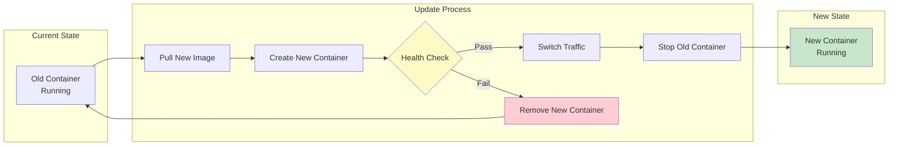
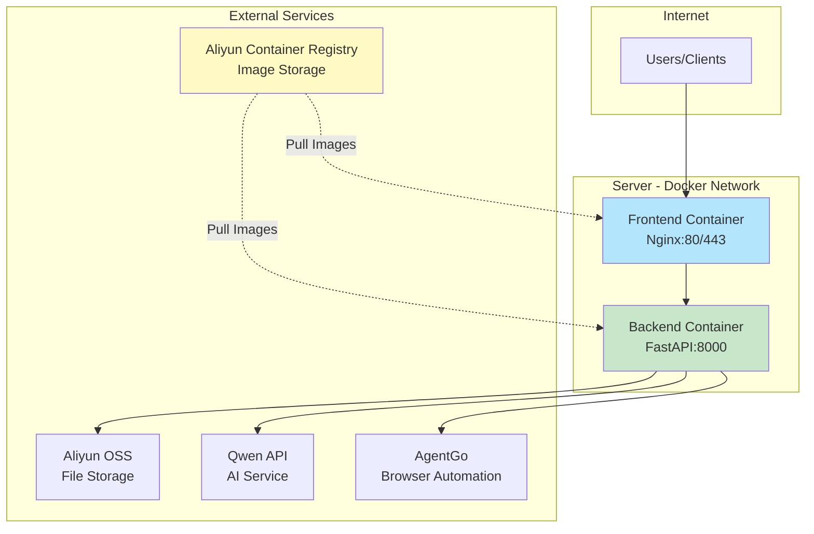
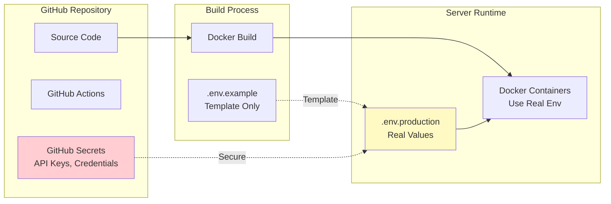
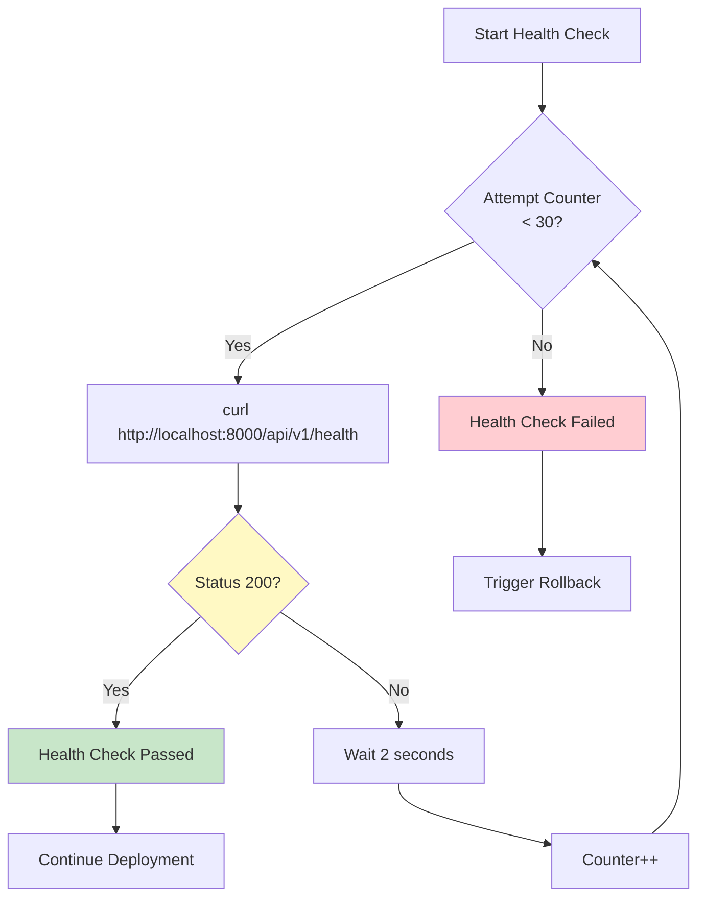
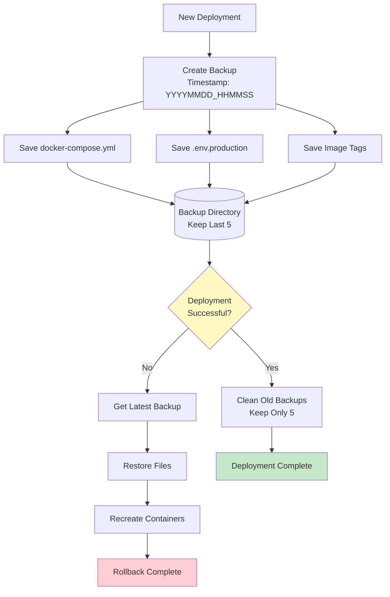
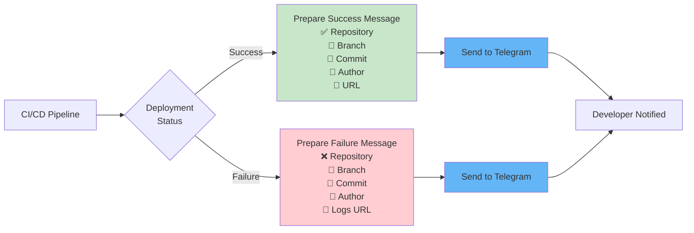

# CI/CD Pipeline Architecture

## Complete Pipeline Flow

```mermaid
graph TB
    Start[Developer Push Code] --> GitHub[GitHub Repository]
    GitHub --> Trigger{GitHub Actions<br/>Triggered}
    
    Trigger --> FrontendCI[Frontend CI Job]
    Trigger --> BackendCI[Backend CI Job]
    
    FrontendCI --> FrontendSteps[1. Type Check<br/>2. Build<br/>3. Upload Artifacts]
    BackendCI --> BackendSteps[1. Install Deps<br/>2. Linting<br/>3. Run Tests]
    
    FrontendSteps --> BuildJob{Build & Push Job<br/>Needs: Both CI Pass}
    BackendSteps --> BuildJob
    
    BuildJob --> Docker[Docker Buildx Setup]
    Docker --> Login[Login to Aliyun Registry]
    Login --> BuildBackend[Build Backend Image]
    Login --> BuildFrontend[Build Frontend Image]
    
    BuildBackend --> PushBackend[Push to Registry<br/>registry.cn-hangzhou.aliyuncs.com]
    BuildFrontend --> PushFrontend[Push to Registry<br/>registry.cn-hangzhou.aliyuncs.com]
    
    PushBackend --> Deploy{Deploy Job<br/>Needs: Build Success}
    PushFrontend --> Deploy
    
    Deploy --> SSH[SSH to Server<br/>via GitHub Actions]
    SSH --> ServerLogin[Login to Aliyun Registry<br/>on Server]
    ServerLogin --> Pull[Pull Latest Images]
    Pull --> Backup[Create Deployment Backup]
    
    Backup --> UpdateBackend[Rolling Update Backend<br/>docker-compose up -d backend]
    UpdateBackend --> HealthCheck1{Backend<br/>Health Check}
    
    HealthCheck1 -->|Pass| UpdateFrontend[Update Frontend<br/>docker-compose up -d frontend]
    HealthCheck1 -->|Fail| Rollback[Automatic Rollback]
    
    UpdateFrontend --> HealthCheck2{Final<br/>Health Check}
    HealthCheck2 -->|Pass| Cleanup[Clean Old Images]
    HealthCheck2 -->|Fail| Rollback
    
    Cleanup --> Success[Deployment Success]
    Success --> NotifySuccess[Send Success Notification<br/>Telegram/Email]
    
    Rollback --> NotifyFail[Send Failure Notification<br/>Telegram/Email]
    
    NotifySuccess --> End[End - Service Running]
    NotifyFail --> End
    
    style Start fill:#e1f5e1
    style Success fill:#c8e6c9
    style Rollback fill:#ffcdd2
    style HealthCheck1 fill:#fff9c4
    style HealthCheck2 fill:#fff9c4
    style Deploy fill:#b3e5fc
    style BuildJob fill:#b3e5fc
```

## Zero-Downtime Deployment Strategy

## Service Architecture on Server

## GitHub Actions Workflow Jobs

```mermaid
gantt
    title CI/CD Pipeline Timeline
    dateFormat  HH:mm:ss
    axisFormat %M:%S
    
    section CI
    Frontend CI           :a1, 00:00:00, 2m
    Backend CI            :a2, 00:00:00, 3m
    
    section Build
    Docker Build Backend  :a3, after a2, 3m
    Docker Build Frontend :a4, after a2, 2m
    
    section Registry
    Push Backend          :a5, after a3, 1m
    Push Frontend         :a6, after a4, 1m
    
    section Deploy
    SSH Connection        :a7, after a5 a6, 30s
    Pull Images           :a8, after a7, 1m
    Update Backend        :a9, after a8, 1m
    Health Check          :a10, after a9, 1m
    Update Frontend       :a11, after a10, 30s
    Final Check           :a12, after a11, 30s
```

## Environment Configuration Flow

## Health Check Process

## Backup and Rollback Strategy

## Notification Flow

---

## Key Features

### ✅ Automated Testing
- Frontend type checking and build
- Backend linting with ruff
- Unit tests with pytest

### 🏗️ Multi-Stage Build
- Optimized Docker images
- Layer caching for faster builds
- Multi-platform support

### 🔄 Zero Downtime
- Rolling updates
- Health checks before traffic switch
- Automatic rollback on failure

### 💾 Backup System
- Automatic backup before deployment
- Keep last 5 backups
- One-command rollback

### 📊 Monitoring
- Health check endpoints
- Real-time logs
- Deployment notifications

### 🔐 Security
- Secrets management via GitHub
- SSH key authentication
- No credentials in code

---

**Total Pipeline Time**: ~8-12 minutes from push to production
