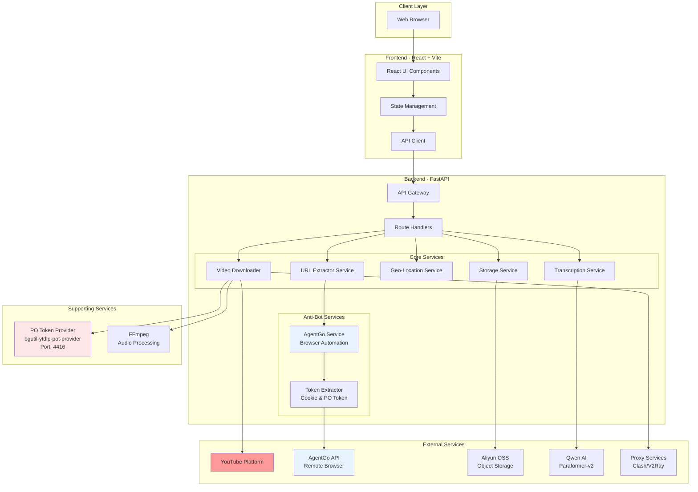
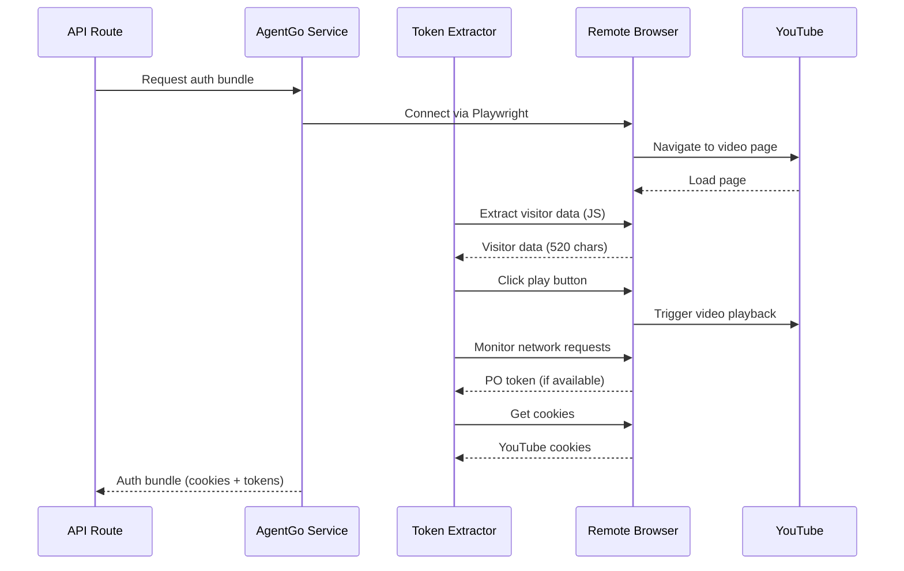
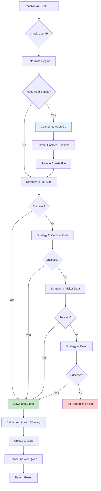
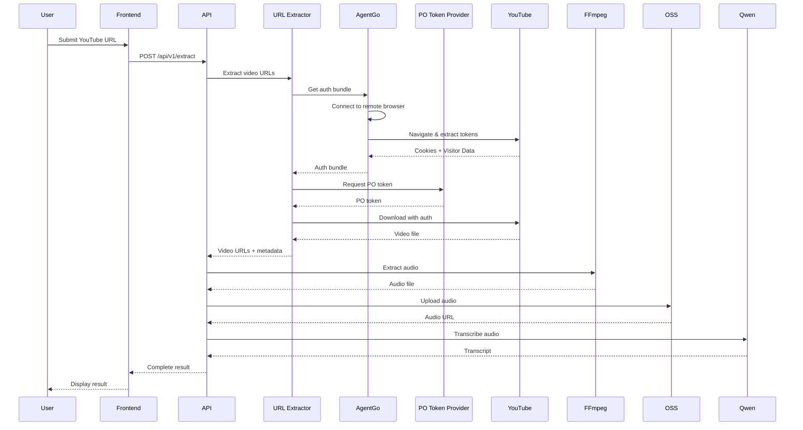
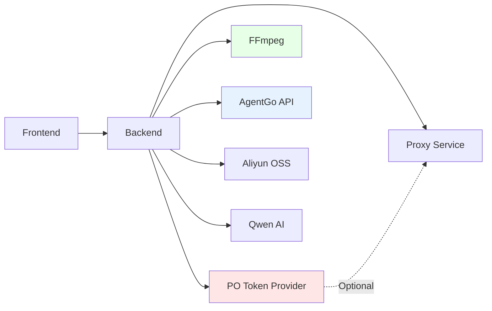

# System Architecture

## Overview

YouTube Download & Transcription Service 是一个完整的全栈应用，用于下载 YouTube 视频、提取音频、进行 AI 转写和智能摘要。系统采用微服务架构，集成了多个外部服务以实现强大的反爬虫能力和高质量的 AI 处理。

## High-Level Architecture



## Component Details

### 1. Frontend Layer

**Technology Stack:**
- React 18 with TypeScript
- Vite for build tooling
- Modern UI components

**Responsibilities:**
- User interface rendering
- Form validation and submission
- Real-time status updates
- Result display and download

**Key Files:**
- `frontend/src/` - Source code
- `frontend/vite.config.ts` - Build configuration
- `frontend/nginx.conf` - Production server config

### 2. Backend API Layer

**Technology Stack:**
- FastAPI (Python 3.10+)
- Uvicorn ASGI server
- Pydantic for data validation
- Async/await for concurrent operations

**Core Components:**

#### API Gateway (`app/main.py`)
- Request routing
- CORS configuration
- Health check endpoints
- Startup/shutdown lifecycle

#### Route Handlers (`app/api/routes.py`)
- `/api/v1/extract` - Extract video URLs
- `/api/v1/download` - Download video
- `/api/v1/transcribe` - Transcribe audio
- `/api/v1/health` - Health check

### 3. Core Services

#### URL Extractor Service (`app/services/url_extractor.py`)

**Purpose:** Extract direct video URLs from YouTube with anti-bot protection

**Strategy Chain:**
1. **Strategy 1**: Basic yt-dlp with cookies + visitor data + PO token
2. **Strategy 2**: yt-dlp with cookies only
3. **Strategy 3**: yt-dlp with visitor data only
4. **Strategy 4**: Basic yt-dlp without authentication
5. **Strategy 5**: Fallback with different client options

**Key Features:**
- Multi-strategy fallback mechanism
- Integration with PO Token Provider
- Cookie management
- Visitor data injection

#### AgentGo Service (`app/services/agentgo_service.py`)

**Purpose:** Browser automation for extracting authentication data

**Capabilities:**
- Connect to remote browser via Playwright
- Extract cookies from authenticated sessions
- Extract PO tokens from network requests
- Extract visitor data from page context
- Manage authentication bundles per region

**Token Extraction Process:**


**Authentication Bundle:**
- Cookies (saved to `/tmp/youtube_cookies/`)
- PO Token (optional, for enhanced access)
- Visitor Data (required for API calls)
- Browser IP (for proxy consistency)

#### Geo-Location Service (`app/services/geo_service.py`)

**Purpose:** Route requests to appropriate regional proxies

**Features:**
- IP geolocation lookup
- Region-based routing (US, EU, Asia)
- Fallback to online API if local DB unavailable
- Proxy consistency management

#### Storage Service (`app/services/storage.py`)

**Purpose:** Manage file uploads to Aliyun OSS

**Features:**
- Async file upload
- Signed URL generation
- Automatic cleanup
- Error handling and retry

#### Transcription Service (`app/services/transcriber.py`)

**Purpose:** Convert audio to text using Qwen AI

**Features:**
- Paraformer-v2 model integration
- Speaker diarization
- Timestamp generation
- Async task polling

### 4. Anti-Bot Protection System

#### PO Token Provider (bgutil-ytdlp-pot-provider)

**Purpose:** Generate Proof-of-Origin tokens to bypass YouTube bot detection

**Technology:**
- Node.js HTTP server
- BgUtils library for token generation
- Runs on port 4416

**Integration:**
- yt-dlp automatically connects to http://127.0.0.1:4416
- Provides tokens for each video request
- Caches tokens for performance

**Setup:**
```bash
cd backend/bgutil-ytdlp-pot-provider/server
node build/main.js
```

**Health Check:**
```bash
curl http://127.0.0.1:4416/ping
# Response: {"server_uptime":123.45,"version":"1.2.2"}
```

#### Why PO Token is Needed

YouTube uses multiple layers of bot detection:
1. **IP-based detection** - Flags suspicious IPs
2. **Behavior analysis** - Detects automated patterns
3. **Token validation** - Requires PO tokens for certain IPs
4. **SABR streaming** - Forces special streaming protocol

Without PO Token:
- ❌ "Sign in to confirm you're not a bot"
- ❌ "Requested format is not available"
- ❌ "Only images are available for download"

With PO Token:
- ✅ Bypasses bot detection
- ✅ Access to all video formats
- ✅ Stable downloads

### 5. Download Strategy Flow



## Data Flow

### Complete Request Flow



## Deployment Architecture

### Development Environment

```
┌─────────────────────────────────────────┐
│         Local Development               │
├─────────────────────────────────────────┤
│                                         │
│  Frontend (Vite Dev Server)             │
│  ├─ Port: 5173                          │
│  └─ Hot Module Replacement              │
│                                         │
│  Backend (Uvicorn)                      │
│  ├─ Port: 8000                          │
│  ├─ Auto-reload enabled                 │
│  └─ Debug logging                       │
│                                         │
│  PO Token Provider (Node.js)            │
│  ├─ Port: 4416                          │
│  └─ Token generation service            │
│                                         │
│  Local Proxy (Optional)                 │
│  └─ Port: 7890 (Clash/V2Ray)            │
│                                         │
└─────────────────────────────────────────┘
```

**Start Command:**
```bash
./start-dev.sh
```

This script starts:
1. Python virtual environment
2. Backend API server
3. Frontend dev server
4. PO Token Provider (manual start required)

### Production Environment (Docker)

```
┌─────────────────────────────────────────┐
│         Docker Network                  │
├─────────────────────────────────────────┤
│                                         │
│  Frontend Container (Nginx)             │
│  ├─ Port: 80                            │
│  ├─ Serves static files                 │
│  └─ Proxies API to backend              │
│                                         │
│  Backend Container (FastAPI)            │
│  ├─ Port: 8000                          │
│  ├─ Production WSGI                     │
│  └─ Health check endpoint               │
│                                         │
│  PO Token Provider (Sidecar)            │
│  ├─ Port: 4416                          │
│  └─ Shared network                      │
│                                         │
└─────────────────────────────────────────┘
         │
         ├─> Aliyun OSS
         ├─> Qwen AI API
         ├─> AgentGo API
         └─> Proxy Services
```

**Start Command:**
```bash
docker-compose up -d
```

## Configuration Management

### Environment Variables

**Backend (.env)**
```bash
# AI Services
QWEN_API_KEY=sk-xxx
QWEN_API_BASE=https://dashscope-intl.aliyuncs.com/...

# Cloud Storage
OSS_ACCESS_KEY_ID=xxx
OSS_ACCESS_KEY_SECRET=xxx
OSS_ENDPOINT=oss-cn-hangzhou.aliyuncs.com
OSS_BUCKET=your-bucket

# Anti-Bot Services
AGENTGO_API_KEY=api_xxx
AGENTGO_API_URL=https://api.datasea.network
YOUTUBE_EMAIL=your-email@gmail.com
YOUTUBE_PASSWORD=your-password

# Proxy Configuration
YOUTUBE_PROXY=http://127.0.0.1:7890
CLASH_API_URL=http://127.0.0.1:33212

# Application Settings
TEMP_DIR=/tmp/video_processing
LOG_LEVEL=INFO
CORS_ORIGINS=http://localhost:5173,http://localhost
```

**Frontend (.env)**
```bash
VITE_API_URL=http://localhost:8000/api
```

## Service Dependencies



### Critical Dependencies

1. **FFmpeg** (Required)
   - Audio extraction
   - Format conversion
   - Install: `brew install ffmpeg` (macOS)

2. **PO Token Provider** (Required for YouTube access)
   - Bypasses bot detection
   - Must be running on port 4416
   - Start: `node backend/bgutil-ytdlp-pot-provider/server/build/main.js`

3. **AgentGo API** (Required for difficult videos)
   - Browser automation
   - Cookie/token extraction
   - Requires API key

4. **Aliyun Services** (Required)
   - OSS for storage
   - Qwen AI for transcription
   - Requires access keys

5. **Proxy Service** (Optional but recommended)
   - Improves success rate
   - Avoids IP blocks
   - Clash/V2Ray on port 7890

## Performance Considerations

### Async Processing

All I/O operations are async:
- Video downloads
- File uploads
- API calls
- Database operations

### Caching Strategy

1. **Token Cache**
   - PO tokens cached for 6 hours
   - Visitor data cached per session
   - Cookies saved to disk

2. **Video Metadata Cache**
   - Reduces repeated API calls
   - TTL: 1 hour

### Resource Management

- Temporary files cleaned after processing
- Connection pooling for HTTP clients
- Graceful shutdown handling

## Security

### API Security

- CORS configuration
- Rate limiting (planned)
- Input validation with Pydantic
- Secure credential storage

### Data Privacy

- Temporary files deleted after processing
- No permanent storage of video content
- Secure OSS signed URLs (expiring)

### Secrets Management

- Environment variables for credentials
- GitHub Secrets for CI/CD
- No hardcoded secrets

## Monitoring & Logging

### Health Checks

```bash
# Backend health
curl http://localhost:8000/api/v1/health

# PO Token Provider health
curl http://localhost:4416/ping
```

### Logging Levels

- **DEBUG**: Detailed execution flow
- **INFO**: Normal operations
- **WARNING**: Recoverable issues
- **ERROR**: Failed operations

### Log Locations

- Development: Console output
- Production: Docker logs
- Access: `docker logs <container-name>`

## Troubleshooting

### Common Issues

1. **PO Token Provider not running**
   - Error: `Error reaching GET http://127.0.0.1:4416/ping`
   - Solution: Start the provider service

2. **FFmpeg not found**
   - Error: `ffmpeg not found`
   - Solution: Install FFmpeg

3. **YouTube bot detection**
   - Error: `Sign in to confirm you're not a bot`
   - Solution: Ensure PO Token Provider is running and AgentGo is configured

4. **Proxy connection failed**
   - Error: `Proxy connection refused`
   - Solution: Check proxy service is running on configured port

## Future Enhancements

- [ ] Redis for distributed caching
- [ ] Message queue for async tasks (Celery/RQ)
- [ ] Database for persistent storage
- [ ] WebSocket for real-time updates
- [ ] Kubernetes deployment
- [ ] Horizontal scaling support
- [ ] Advanced monitoring (Prometheus/Grafana)

---

**Last Updated:** 2026-01-17
