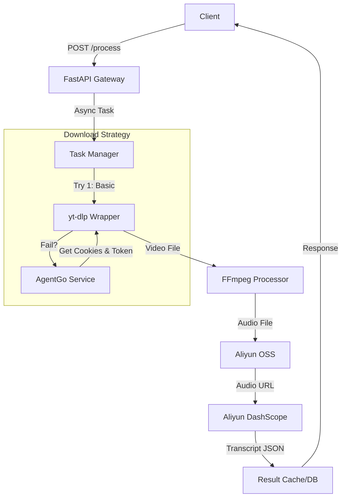

# YouTube Video Processing & Transcription API

## 1. 项目简介 (Introduction)

本项目是一个高性能、抗反爬虫的后端 API 服务，旨在实现 YouTube 视频的**自动化下载**、**音频提取**、**云端存储**以及**高精度 AI 字幕转写**。

系统基于 FastAPI 构建，核心设计目标是解决 YouTube 平台严格的机器人检测（Bot Detection）问题。通过集成 AgentGo 浏览器环境模拟和阿里云的智能服务，为用户提供稳定的一站式音视频内容数字化解决方案。

### 核心特性

*   **🛡️ 智能抗反爬策略 (Robust Anti-Scraping)**: 内置下载回退机制（Fallback Strategy）：
    1.  常规尝试（直接下载或通过代理）。
    2.  调用 AgentGo 服务模拟真实浏览器环境获取 Cookies 和 Token。
*   **⚡ 异步任务处理**: 采用异步架构处理耗时的下载与转写任务，保证 API 接口的高响应速度。
*   **☁️ 云原生集成**: 无缝对接阿里云 OSS（对象存储）和 DashScope（通义听悟/Paraformer-v2），实现海量存储与高精度语音识别（区分说话人）。
*   **🔧 自动化工作流**: 视频 URL -> 音频提取 (FFmpeg) -> 云端上传 -> AI 转写 -> 结构化数据输出。

---

## 2. 技术栈 (Tech Stack)

*   **Web 框架**: [FastAPI](https://fastapi.tiangolo.com/) (Python 3.10+)
*   **核心下载引擎**: [yt-dlp](https://github.com/yt-dlp/yt-dlp) (定制化配置)
*   **媒体处理**: [FFmpeg](https://ffmpeg.org/) (音频提取与格式转换)
*   **AI 转写服务**: Aliyun DashScope (Paraformer-v2 模型)
*   **云存储**: Aliyun OSS (Object Storage Service)
*   **代理与反爬辅助**:
    *   AgentGo (浏览器环境模拟与 Cookie/Token 自动化)
*   **部署**: Docker, Nixpacks, Railway

---

## 3. 系统架构 (Architecture)

### 数据流向
1.  **接收请求**: 用户通过 API 提交 YouTube 视频链接。
2.  **下载调度**:
    *   系统首先尝试直接或通过基础代理下载。
    *   若遇 403/Bot 拦截，调用 **AgentGo Service** 在隔离浏览器环境中解析并注入有效 Cookies 和 Token。
3.  **媒体处理**: 下载完成后，使用 **FFmpeg** 提取音频流并转换为标准格式（如 MP3/WAV）。
4.  **云端存储**: 处理后的音频异步上传至 **阿里云 OSS**，生成可访问的签名 URL。
5.  **AI 转写**: 将 OSS URL 提交给 **DashScope (Paraformer)** 进行语音识别，获取带时间戳和说话人区分的字幕结果。
6.  **结果返回**: 最终结构化数据（Metadata + Transcript）返回给客户端。

### 架构流程图



---

## 4. 环境准备与安装 (Setup & Installation)

### 前置要求
*   **Python**: 3.10 或更高版本
*   **FFmpeg**: 必须安装并配置在系统 PATH 中。
*   **AgentGo** (可选): 如果需要处理高难度反爬链接。

### 本地开发 (Local Development)

1.  **克隆项目**
    ```bash
    git clone <repository_url>
    cd backend
    ```

2.  **创建虚拟环境并安装依赖**
    ```bash
    python -m venv venv
    source venv/bin/activate  # macOS/Linux
    # venv\Scripts\activate  # Windows
    pip install -r requirements.txt
    ```

3.  **配置环境变量**
    复制 `.env.example` 为 `.env` 并填入配置（详见下一节）。
    ```bash
    cp .env.example .env
    ```

4.  **启动服务**
    ```bash
    uvicorn app.main:app --reload --host 0.0.0.0 --port 8000
    ```

### Docker 部署

1.  **构建镜像**
    ```bash
    docker build -t youtube-backend .
    ```

2.  **运行容器**
    ```bash
    docker run -d \
      --name youtube-backend \
      --env-file .env \
      -p 8000:8000 \
      youtube-backend
    ```

---

## 5. 配置说明 (Configuration)

请务必在 `.env` 文件中配置以下关键参数。

### 基础配置
*   `ENV`: 运行环境 (`development` / `production`)。
*   `API_SECRET`: (可选) 用于接口鉴权的密钥。

### 阿里云服务 (必需)
*   `OSS_ACCESS_KEY_ID`: 阿里云 RAM 用户 Key ID。
*   `OSS_ACCESS_KEY_SECRET`: 阿里云 RAM 用户 Secret。
*   `OSS_ENDPOINT`: OSS 区域节点 (e.g., `oss-cn-hangzhou.aliyuncs.com`)。
*   `OSS_BUCKET_NAME`: 存储音频文件的 Bucket 名称。
*   `DASHSCOPE_API_KEY`: 开通 DashScope 服务后获取的 API Key (用于语音转写)。

### 代理与反爬配置
*   `YOUTUBE_PROXY`: (可选) 基础 HTTP/SOCKS5 代理地址，例如 `http://127.0.0.1:7890`。
*   `AGENTGO_API_URL`: (可选) AgentGo 服务的 API 地址。当常规下载失败时，系统会向此服务请求 Cookies 和 Token。

---

## 6. API 接口说明 (API Usage)

### 1. 提交处理任务
**Endpoint**: `POST /api/v1/process`

提交一个 YouTube URL 进行下载和转写。

**Request:**
```json
{
  "url": "https://www.youtube.com/watch?v=dQw4w9WgXcQ",
  "language": "en" 
}
```

**Response:**
```json
{
  "task_id": "550e8400-e29b-41d4-a716-446655440000",
  "status": "processing",
  "message": "Task queued successfully"
}
```

**cURL 示例:**
```bash
curl -X POST "http://localhost:8000/api/v1/process" \
     -H "Content-Type: application/json" \
     -d '{"url": "https://www.youtube.com/watch?v=example"}'
```

### 2. 查询任务状态
**Endpoint**: `GET /api/v1/status/{task_id}`

**Response:**
```json
{
  "task_id": "...",
  "status": "uploading_to_oss", // pending, processing, downloading, transcribing, completed, failed
  "progress": 45
}
```

### 3. 获取最终结果
**Endpoint**: `GET /api/v1/result/{task_id}`

**Response:**
```json
{
  "video_title": "Example Video",
  "audio_url": "https://bucket.oss-region.aliyuncs.com/audio.mp3",
  "transcription": [
    {
      "speaker": "Speaker 1",
      "start_time": 0.5,
      "end_time": 2.1,
      "text": "Hello world."
    }
  ]
}
```

---

## 7. 常见问题 (Troubleshooting)

**Q1: 报错 "Sign in to confirm your age" 或 "Bot Detection Error"**
*   **原因**: YouTube 识别到了服务器 IP 异常或没有登录状态。
*   **解决**: 
    1. 确保 `.env` 中配置了有效的 `YOUTUBE_PROXY`。
    2. 检查 `AGENTGO_API_URL` 是否配置且服务正常运行，以便系统能获取真实 Cookies 和 Token。

**Q2: 报错 "ffmpeg not found"**
*   **原因**: 运行环境未安装 FFmpeg 或未添加到环境变量。
*   **解决**: 
    *   **Mac**: `brew install ffmpeg`
    *   **Ubuntu**: `apt-get install ffmpeg`
    *   **Docker**: 确保 Dockerfile 中包含 `apt-get install -y ffmpeg`。

**Q3: 转写结果一直为空**
*   **原因**: 阿里云 DashScope 任务可能超时或 Key 余额不足。
*   **解决**: 检查 `DEBUG_LOG.md` 或控制台日志中关于 `transcriber.py` 的报错信息；登录阿里云控制台检查 DashScope 服务状态。
