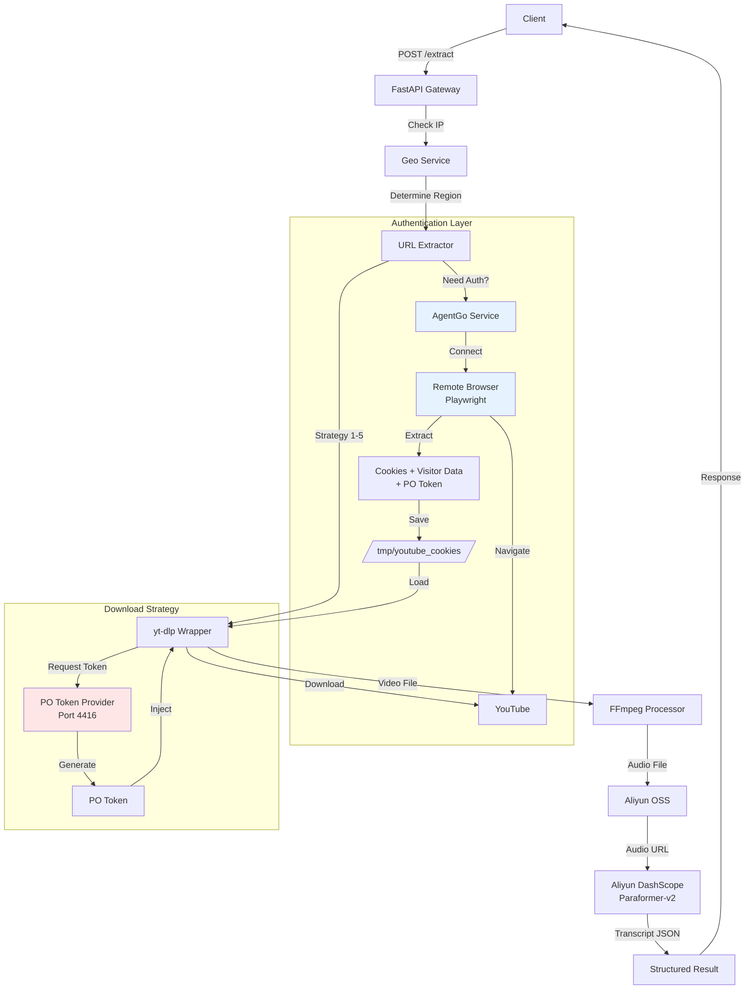
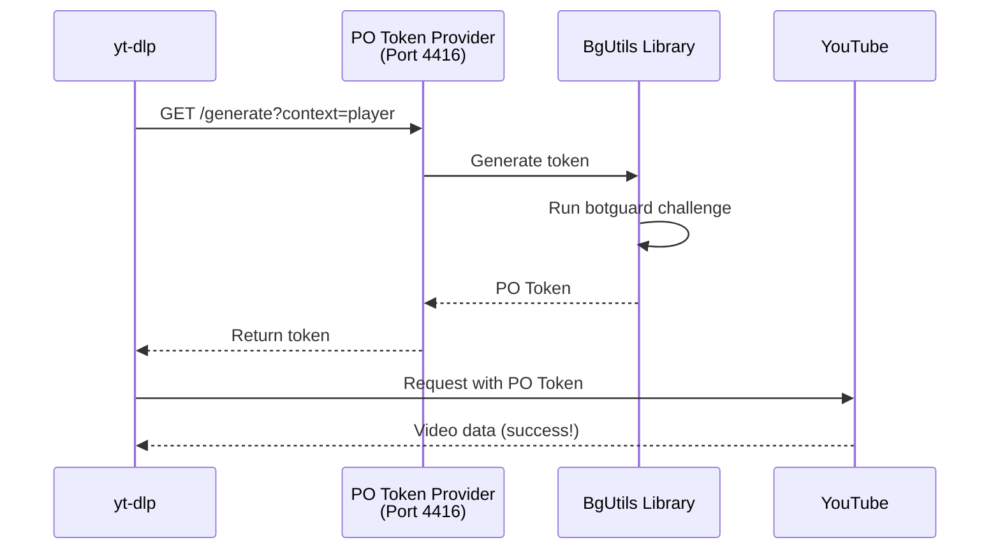

# YouTube Video Processing & Transcription API

## 1. 项目简介 (Introduction)

本项目是一个高性能、抗反爬虫的后端 API 服务，旨在实现 YouTube 视频的**自动化下载**、**音频提取**、**云端存储**以及**高精度 AI 字幕转写**。

系统基于 FastAPI 构建，核心设计目标是解决 YouTube 平台严格的机器人检测（Bot Detection）问题。通过集成 AgentGo 浏览器环境模拟和阿里云的智能服务，为用户提供稳定的一站式音视频内容数字化解决方案。

### 核心特性

*   **🛡️ 智能抗反爬策略 (Robust Anti-Scraping)**: 内置下载回退机制（Fallback Strategy）：
    1.  常规尝试（直接下载或通过代理）。
    2.  调用 AgentGo 服务模拟真实浏览器环境获取 Cookies 和 Token。
*   **⚡ 异步任务处理**: 采用异步架构处理耗时的下载与转写任务，保证 API 接口的高响应速度。
*   **☁️ 云原生集成**: 无缝对接阿里云 OSS（对象存储）和 DashScope（通义听悟/Paraformer-v2），实现海量存储与高精度语音识别（区分说话人）。
*   **🔧 自动化工作流**: 视频 URL -> 音频提取 (FFmpeg) -> 云端上传 -> AI 转写 -> 结构化数据输出。

---

## 2. 技术栈 (Tech Stack)

*   **Web 框架**: [FastAPI](https://fastapi.tiangolo.com/) (Python 3.10+)
*   **核心下载引擎**: [yt-dlp](https://github.com/yt-dlp/yt-dlp) (定制化配置)
*   **媒体处理**: [FFmpeg](https://ffmpeg.org/) (音频提取与格式转换)
*   **AI 转写服务**: Aliyun DashScope (Paraformer-v2 模型)
*   **云存储**: Aliyun OSS (Object Storage Service)
*   **反爬虫系统**:
    *   **PO Token Provider**: [bgutil-ytdlp-pot-provider](https://github.com/Brainicism/bgutil-ytdlp-pot-provider) (生成 Proof-of-Origin tokens)
    *   **AgentGo**: 浏览器环境模拟与 Cookie/Token 自动化
    *   **Playwright**: 浏览器自动化框架
*   **部署**: Docker, Docker Compose, GitHub Actions CI/CD

---

## 3. 系统架构 (Architecture)

### 核心组件

1. **API Gateway (FastAPI)**
   - 请求路由和验证
   - CORS 配置
   - 健康检查端点

2. **URL Extractor Service**
   - 多策略回退机制（5种策略）
   - 集成 PO Token Provider
   - Cookie 和 Visitor Data 管理

3. **AgentGo Service**
   - 远程浏览器连接（Playwright）
   - Cookie 提取
   - PO Token 提取（从网络请求）
   - Visitor Data 提取（从页面上下文）

4. **PO Token Provider**
   - Node.js HTTP 服务器（端口 4416）
   - 使用 BgUtils 库生成 Proof-of-Origin tokens
   - 绕过 YouTube 机器人检测

5. **Geo-Location Service**
   - IP 地理位置查询
   - 区域路由（US, EU, Asia）
   - 代理一致性管理

6. **Storage Service**
   - 异步文件上传到阿里云 OSS
   - 签名 URL 生成
   - 自动清理

7. **Transcription Service**
   - Paraformer-v2 模型集成
   - 说话人区分
   - 时间戳生成

### 数据流向

1.  **接收请求**: 用户通过 API 提交 YouTube 视频链接。
2.  **地理路由**: 根据用户 IP 确定最佳区域和代理。
3.  **认证准备**:
    *   连接到 AgentGo 远程浏览器
    *   提取 Cookies（保存到 `/tmp/youtube_cookies/`）
    *   提取 Visitor Data（520 字符标识符）
    *   尝试提取 PO Token（从网络请求）
4.  **下载调度**（多策略回退）:
    *   **策略 1**: 完整认证（Cookies + Visitor Data + PO Token）
    *   **策略 2**: 仅 Cookies
    *   **策略 3**: 仅 Visitor Data
    *   **策略 4**: 基础下载
    *   **策略 5**: 备用客户端选项
5.  **PO Token 生成**: yt-dlp 自动连接到本地 PO Token Provider (http://127.0.0.1:4416)
6.  **媒体处理**: 使用 **FFmpeg** 提取音频流并转换为标准格式（如 MP3/WAV）。
7.  **云端存储**: 处理后的音频异步上传至 **阿里云 OSS**，生成可访问的签名 URL。
8.  **AI 转写**: 将 OSS URL 提交给 **DashScope (Paraformer)** 进行语音识别，获取带时间戳和说话人区分的字幕结果。
9.  **结果返回**: 最终结构化数据（Metadata + Transcript）返回给客户端。

### 架构流程图



### 反爬虫保护系统

#### 为什么需要 PO Token？

YouTube 使用多层机器人检测：
1. **基于 IP 的检测** - 标记可疑 IP
2. **行为分析** - 检测自动化模式
3. **Token 验证** - 某些 IP 需要 PO tokens
4. **SABR 流媒体** - 强制特殊流媒体协议

**没有 PO Token 的后果：**
- ❌ "Sign in to confirm you're not a bot"
- ❌ "Requested format is not available"
- ❌ "Only images are available for download"
- ❌ "Some web client https formats have been skipped"

**使用 PO Token 的好处：**
- ✅ 绕过机器人检测
- ✅ 访问所有视频格式
- ✅ 稳定的下载体验

#### PO Token Provider 工作原理



---

## 4. 环境准备与安装 (Setup & Installation)

### 前置要求
*   **Python**: 3.10 或更高版本
*   **Node.js**: 18 或更高版本（用于 PO Token Provider）
*   **FFmpeg**: 必须安装并配置在系统 PATH 中
*   **AgentGo API Key**: 用于浏览器自动化（可选但推荐）

### 本地开发 (Local Development)

#### 方法 1: 使用启动脚本（推荐）

1.  **克隆项目**
    ```bash
    git clone <repository_url>
    cd youtube_download
    ```

2.  **配置环境变量**
    ```bash
    cp backend/.env.example backend/.env
    # 编辑 backend/.env 填入你的 API keys
    ```

3.  **启动所有服务**
    ```bash
    chmod +x start-dev.sh
    ./start-dev.sh
    ```
    
    这个脚本会自动启动：
    - ✅ Python 虚拟环境
    - ✅ 后端 API 服务器（端口 8000）
    - ✅ 前端开发服务器（端口 5173）
    - ⚠️ 需要手动启动 PO Token Provider（见下方）

4.  **启动 PO Token Provider**（在新终端窗口）
    ```bash
    cd backend/bgutil-ytdlp-pot-provider/server
    node build/main.js
    ```
    
    验证服务运行：
    ```bash
    curl http://127.0.0.1:4416/ping
    # 应返回: {"server_uptime":123.45,"version":"1.2.2"}
    ```

#### 方法 2: 手动启动

1.  **克隆项目**
    ```bash
    git clone <repository_url>
    cd backend
    ```

2.  **创建虚拟环境并安装依赖**
    ```bash
    python -m venv venv
    source venv/bin/activate  # macOS/Linux
    # venv\Scripts\activate  # Windows
    pip install -r requirements.txt
    ```

3.  **配置环境变量**
    复制 `.env.example` 为 `.env` 并填入配置（详见下一节）。
    ```bash
    cp .env.example .env
    ```

4.  **启动 PO Token Provider**（新终端）
    ```bash
    cd bgutil-ytdlp-pot-provider/server
    npm install  # 首次运行
    npx tsc      # 编译 TypeScript
    node build/main.js
    ```

5.  **启动后端服务**
    ```bash
    uvicorn app.main:app --reload --host 0.0.0.0 --port 8000
    ```

### Docker 部署

1.  **构建镜像**
    ```bash
    docker build -t youtube-backend ./backend
    ```

2.  **运行容器**
    ```bash
    docker run -d \
      --name youtube-backend \
      --env-file backend/.env \
      -p 8000:8000 \
      youtube-backend
    ```

3.  **使用 Docker Compose（推荐）**
    ```bash
    docker-compose up -d
    ```
    
    这会启动：
    - 后端容器（端口 8000）
    - 前端容器（端口 80）
    - 共享网络和卷

---

## 5. 配置说明 (Configuration)

请务必在 `.env` 文件中配置以下关键参数。

### 基础配置
*   `ENV`: 运行环境 (`development` / `production`)。
*   `API_SECRET`: (可选) 用于接口鉴权的密钥。

### 阿里云服务 (必需)
*   `OSS_ACCESS_KEY_ID`: 阿里云 RAM 用户 Key ID。
*   `OSS_ACCESS_KEY_SECRET`: 阿里云 RAM 用户 Secret。
*   `OSS_ENDPOINT`: OSS 区域节点 (e.g., `oss-cn-hangzhou.aliyuncs.com`)。
*   `OSS_BUCKET_NAME`: 存储音频文件的 Bucket 名称。
*   `DASHSCOPE_API_KEY`: 开通 DashScope 服务后获取的 API Key (用于语音转写)。

### 代理与反爬配置
*   `YOUTUBE_PROXY`: (可选) 基础 HTTP/SOCKS5 代理地址，例如 `http://127.0.0.1:7890`。
*   `AGENTGO_API_URL`: (可选) AgentGo 服务的 API 地址。当常规下载失败时，系统会向此服务请求 Cookies 和 Token。

---

## 6. API 接口说明 (API Usage)

### 1. 提交处理任务
**Endpoint**: `POST /api/v1/process`

提交一个 YouTube URL 进行下载和转写。

**Request:**
```json
{
  "url": "https://www.youtube.com/watch?v=dQw4w9WgXcQ",
  "language": "en" 
}
```

**Response:**
```json
{
  "task_id": "550e8400-e29b-41d4-a716-446655440000",
  "status": "processing",
  "message": "Task queued successfully"
}
```

**cURL 示例:**
```bash
curl -X POST "http://localhost:8000/api/v1/process" \
     -H "Content-Type: application/json" \
     -d '{"url": "https://www.youtube.com/watch?v=example"}'
```

### 2. 查询任务状态
**Endpoint**: `GET /api/v1/status/{task_id}`

**Response:**
```json
{
  "task_id": "...",
  "status": "uploading_to_oss", // pending, processing, downloading, transcribing, completed, failed
  "progress": 45
}
```

### 3. 获取最终结果
**Endpoint**: `GET /api/v1/result/{task_id}`

**Response:**
```json
{
  "video_title": "Example Video",
  "audio_url": "https://bucket.oss-region.aliyuncs.com/audio.mp3",
  "transcription": [
    {
      "speaker": "Speaker 1",
      "start_time": 0.5,
      "end_time": 2.1,
      "text": "Hello world."
    }
  ]
}
```

---

## 7. 常见问题 (Troubleshooting)

**Q1: 报错 "Error reaching GET http://127.0.0.1:4416/ping"**
*   **原因**: PO Token Provider 服务未运行。
*   **解决**: 
    ```bash
    cd backend/bgutil-ytdlp-pot-provider/server
    node build/main.js
    ```
    验证服务：`curl http://127.0.0.1:4416/ping`

**Q2: 报错 "Failed to fetch gvs PO Token for web client: No request handlers configured"**
*   **原因**: yt-dlp 无法连接到 PO Token Provider。
*   **解决**: 
    1. 确保 PO Token Provider 在端口 4416 运行
    2. 检查防火墙是否阻止本地连接
    3. 验证 yt-dlp 版本 >= 2025.05.22

**Q3: 报错 "Sign in to confirm your age" 或 "Bot Detection Error"**
*   **原因**: YouTube 识别到了服务器 IP 异常或没有登录状态。
*   **解决**: 
    1. 确保 PO Token Provider 正在运行
    2. 确保 `.env` 中配置了有效的 `YOUTUBE_PROXY`
    3. 检查 `AGENTGO_API_KEY` 是否配置且服务正常运行
    4. 查看日志确认 Cookie 和 Visitor Data 是否成功提取

**Q4: 报错 "Requested format is not available" 或 "Only images are available"**
*   **原因**: YouTube 强制 SABR 流媒体，但缺少有效的 PO Token。
*   **解决**: 
    1. 启动 PO Token Provider
    2. 检查日志中是否有 "PO token found" 消息
    3. 如果 PO Token 提取失败，系统会使用 Visitor Data 作为备选

**Q5: 报错 "ffmpeg not found"**
*   **原因**: 运行环境未安装 FFmpeg 或未添加到环境变量。
*   **解决**: 
    *   **Mac**: `brew install ffmpeg`
    *   **Ubuntu**: `apt-get install ffmpeg`
    *   **Docker**: 确保 Dockerfile 中包含 `apt-get install -y ffmpeg`。

**Q6: 转写结果一直为空**
*   **原因**: 阿里云 DashScope 任务可能超时或 Key 余额不足。
*   **解决**: 检查 `DEBUG_LOG.md` 或控制台日志中关于 `transcriber.py` 的报错信息；登录阿里云控制台检查 DashScope 服务状态。

**Q7: "No PO token found in network requests"**
*   **原因**: 这是正常情况，不是所有请求都能捕获到 PO Token。
*   **说明**: 系统会自动使用 Visitor Data 作为备选方案，通常仍能成功下载。

**Q8: AgentGo 连接超时**
*   **原因**: AgentGo API 服务不可用或网络问题。
*   **解决**: 
    1. 检查 `AGENTGO_API_URL` 配置
    2. 验证 API Key 是否有效
    3. 查看 AgentGo 服务状态

## 8. 服务端口说明

| 服务 | 端口 | 说明 |
|------|------|------|
| 后端 API | 8000 | FastAPI 主服务 |
| 前端开发服务器 | 5173 | Vite dev server |
| 前端生产服务器 | 80 | Nginx (Docker) |
| PO Token Provider | 4416 | Token 生成服务 |
| 本地代理 | 7890 | Clash/V2Ray (可选) |
| Clash API | 33212 | 代理管理 (可选) |

## 9. 性能优化建议

1. **启用代理**: 配置 `YOUTUBE_PROXY` 提高成功率
2. **使用 AgentGo**: 处理困难视频时自动获取认证
3. **PO Token 缓存**: Provider 自动缓存 token 6 小时
4. **异步处理**: 所有 I/O 操作都是异步的
5. **连接池**: HTTP 客户端使用连接池

## 10. 日志和调试

### 查看日志

**开发环境：**
```bash
# 后端日志直接输出到控制台
# 设置日志级别
export LOG_LEVEL=DEBUG
```

**生产环境（Docker）：**
```bash
# 查看后端日志
docker logs yt-transcriber-backend -f

# 查看 PO Token Provider 日志
docker logs bgutil-provider -f
```

### 调试模式

在 `.env` 中设置：
```bash
LOG_LEVEL=DEBUG
```

这会输出详细的执行流程，包括：
- 策略选择
- Token 提取过程
- 网络请求详情
- 错误堆栈

## 11. 相关文档

- [系统架构详解](../architecture/system_architecture.md)
- [快速启动指南](../guides/quick_start.md)
- [部署指南](../guides/deployment_guide.md)
- [代理一致性指南](../guides/proxy-consistency-guide.md)
